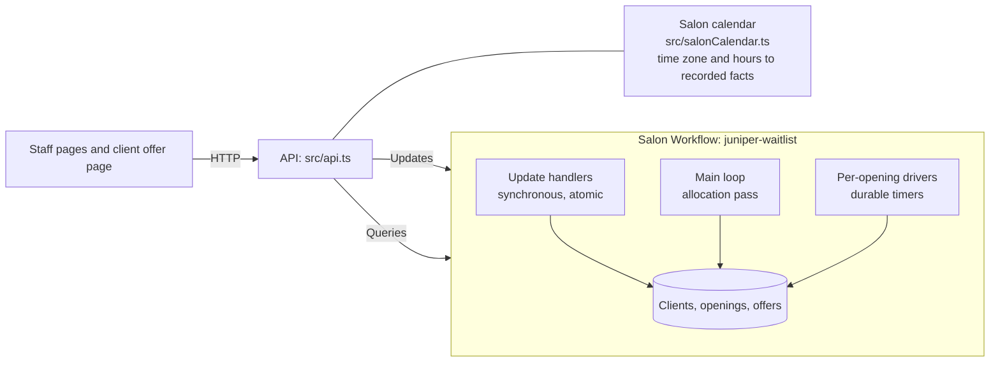

# Architecture

## One long-running salon Workflow
- **One Workflow owns everything.** All of the salon's state (clients, openings, offers) lives in one Workflow, `salonWaitlistWorkflow`, with ID `juniper-waitlist`.
- **Why one Workflow:** the important rules span several openings and clients:
  - one booking per opening
  - one pending offer per client
  - a freed appointment created together with the move

  In one Workflow, each is a synchronous state change, with no cross-Workflow locks or eventual consistency.
- **Updates** (validated; rejected input never enters history):

  | Update | What it does |
  |---|---|
  | `addClient` | Adds a client to the waitlist |
  | `createOpening` | Adds an opening |
  | `respondToOffer` | A client accepts or declines |
  | `includePreferredClient` | Staff include a "Prefers" client for one opening |
  | `markRecordedInSquare` | Staff mark a booking's Square reminder done |

- **Queries:** `getSnapshot` (staff pages), `getOffer` (client page), `getPolicy` (startup guard).
- **The API is thin.** Business decisions are made in the Workflow. The API only resolves time-zone facts and starts or attaches to the Workflow.

## Deciding offers: one deterministic allocation pass
- **Where decisions happen:** a pure function, `allocateOffers` (`src/allocation.ts`), runs in the Workflow's main loop whenever something changes that could free a client or make one eligible:
  - a client is added
  - an offer is declined, accepted or expires
  - an opening is added or reopened
- **What it does:** it walks the openings that need a client in **creation order**, and the eligible clients in **join order**. For each opening it decides: offer, **wait**, or close as unfilled with a reason.
- **Eligibility** (`src/matching.ts`):
  - **Service:** the client wants the opening's service.
  - **Length:** it fits.
  - **Availability:** their availability covers the appointment.
  - **Stylist:** "Only with" is strict. "Prefers" matches that stylist automatically, and other stylists only when staff include them for that opening.
  - **Existing appointment:** a client who already has one is only offered **earlier** openings.
- **Who holds an offer comes from the offers themselves:** a client is busy while one of their offers is pending. There's no separate ownership map that could go stale.
- **Waiting:** an opening whose fitting clients are all busy **waits** (it isn't marked unfilled) and is re-evaluated on the next change.

## Durable deadlines
- **When an offer expires** (`offerExpiresAt`):
  - same-day openings: 15 minutes after it's sent
  - later-day openings: closing time that day
  - sent near or after closing: the next opening time
  - never past the appointment start
- **Each offer has one durable timer** in its opening's driver (`condition(…, timeout)`). It's cancelled if the client answers first.
- **The deadline decides lateness, not the timer.** `respondToOffer` checks `now >= expiresAt` before anything else, so a reply exactly at the deadline is late, whether or not the timer has fired yet.
- **One expiry step:** the timer and late-reply paths share one idempotent `expireOffer`, so an offer expires exactly once.

## Moves and freed appointments
- **Accepting an earlier opening moves the client** if they have a current appointment. In **the same handler**, it:
  1. reserves the opening
  2. creates the **freed opening** from the old appointment (its service, stylist, length and start)
  3. records the move
- **The freed opening is an ordinary opening:** the same allocation pass and the same deadlines. It's never offered back to the client who vacated it.
- **Cascades** (the next client also moving) follow naturally.

## Determinism and versioning
- **No time-zone work inside the Workflow:**
  - Time-zone rules (IANA zone, via Luxon) are applied in the **API** (`src/salonCalendar.ts`).
  - Each opening and appointment carries recorded salon-local facts (date, weekday, minutes) and a calendar of UTC opening and closing instants, as **Update input**.
  - Inside the Workflow, deadlines and matching are plain comparisons of recorded numbers, so replay can't change with a Node, ICU or tzdata upgrade.
  - A test bundles the Workflow code and asserts it contains no time-zone library.
- **Version gates:** two behavior changes were made after histories existed.
  - **`patched("service-eligibility")`:** histories recorded before the service rule was enforced replay with the old rule.
  - **`patched("one-pending-offer")`:** openings from earlier histories run the previous orchestration (`runOpeningLegacy`).
- **Proof:**
  - five captured live histories (`tests/histories/*.binpb`) are replayed in `tests/determinism.test.ts` with `Worker.runReplayHistory`, and Workflow tests capture and replay their own histories
  - removing either gate makes older histories fail replay
  - to capture a new one: `npx tsx scripts/capture-history.ts juniper-waitlist tests/histories/<name>.binpb` (it scrubs worker identity)
- **Neutral identities:** the Worker and the API use the Temporal identities `juniper-worker` and `juniper-api` instead of the default `pid@hostname`, so histories and the Web UI don't show the machine name.

## Startup policy guard
- **Policy is Workflow input:** the reply windows and time zone are recorded when the salon Workflow starts. A running Workflow keeps them.
- **The guard:** at startup the API queries `getPolicy` and **refuses to start** if the running salon's policy differs from `config/salon.json`. This stops a demo override from silently staying in effect.
- **It never terminates Workflows.**

## Known limitations
- **Simulated integrations:** no SMS; Square isn't integrated (staff mark reminders done). "Mark as recorded" has no undo.
- **One long-running Workflow with no Continue-As-New:** its history grows without limit.
- **Calendar data per opening:** each opening records one calendar day per day until its date (about 100 bytes per day), so far-future openings are larger.
- **Sample salon data:** hours and time zone are sample configuration. Appointments keep the calendar recorded when they were entered, even if hours change later.
- **Closed openings stay closed:** an opening closed as unfilled stays closed unless staff include a client. New clients only reach openings that are still active or waiting.
- **Contention rule is an assumption:** when openings compete for a client, opening creation order wins. That's a prototype assumption, not something the customer specified.
- **Not built:** cancelling openings, editing or removing clients, client cancellations after booking, and an add-client form.
